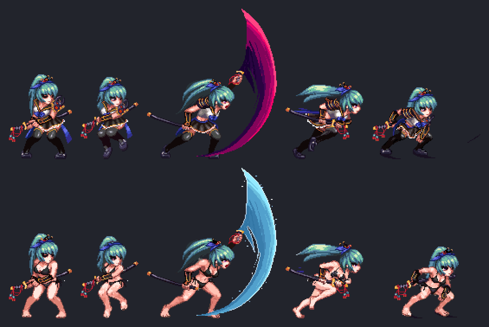

# pixel-forge

**AI pixel art that stays pixel art.**

An image model draws; deterministic tools put the result back on one pixel grid, on a
palette, with real transparency, and keep animation frames from shimmering. Draw a sprite
from a sentence, animate it on a fixed canvas, edit one detail, or turn any off-grid
render into a clean sprite, with any OpenAI-compatible image endpoint.



## Install

```sh
./install.sh
```

Needs [Rust](https://rustup.rs) and [uv](https://docs.astral.sh/uv/). It builds `pxf`,
installs the `pixel-forge` command, creates `.env` and, if Claude Code is installed,
connects it as an MCP server. Then fill in `.env`:

| `.env` | meaning |
|---|---|
| `PXF_API_BASE` | OpenAI-compatible base URL, without `/v1` |
| `PXF_API_KEY` | bearer token |
| `PXF_IMAGE_MODEL` | image model (`/v1/images/generations` and `/v1/images/edits`) |
| `PXF_CHAT_IMAGE_MODEL` | optional: an image model behind `/v1/chat/completions` |

## Use it from an agent (MCP)

`install.sh` already connected it to Claude Code. Any other MCP client: run `pixel-forge mcp`
over stdio. Then just ask: *"draw a 24x24 red paper lantern on sweetie16, then make it sway in 4 frames"*.

| tool | what it does |
|---|---|
| `create` | a new sprite from text at exactly WxH; `variants` for several candidates |
| `create_set` | a whole set (icons, items, tiles) in one picture, so it shares one style and palette |
| `animate` | a finished sprite → a looping animation on the same canvas (sheet, GIF, WebP) |
| `edit` | change one thing, same canvas and grid; answers before \| after |
| `pixelize` | a picture you already have (another tool's render, an upscale) → a sprite; no model call |
| `look`, `bundle`, `palettes` | view a PNG zoomed; frames → sheet + GIF; the preset palettes |

Every tool answers with the files it wrote and a zoomed preview the agent can see.

## Use it from the shell

```sh
pixel-forge create out/panda --prompt "a chubby panda scholar in a red robe" \
    --size 48x48 --variants 3 --palette sweetie16 --name panda
pixel-forge animate out/panda/panda_2.png out/wave \
    --prompt "waves its right paw" --frames 6 --pad 4,4,4,0 --lock 12,12,24,16
pixel-forge edit out/panda/panda_2.png out/blue.png \
    --prompt "make the robe indigo" --palette 1c2f5a,2b4a8a
pixel-forge create out/icons --items "sword=a short sword|potion=a red potion" \
    --size 32x32 --palette sweetie16 --prompt "menu icons for a cosy fantasy game"
pixel-forge pixelize render.png sprite.png --size 32x32 --palette pico8
```

`pixel-forge` alone lists the commands; a command with no arguments (`pixel-forge create`) prints its options.

Tips:

- **Palette**: a preset (`pico8`, `sweetie16`, `gameboy`), hex list, `.gpl`/`.hex` file, or
  PNGs whose colours are the palette. To make sprites match, pass the first finished one
  as the next one's palette.
- **Animate**: keep 4–8 frames, `--lock` what must not move (a face), `--pad` for room to
  move. If a frame looks wrong, check `work/answer.png`.
- **Edit** only adds colours you allow through `--palette`.
- `--reuse` on `create` redoes the pixel steps at another size or palette without a new
  model call.

## Whole animations and games

Redrawing every frame of a game character (a new outfit across 50 animations), the
measurements behind each step, the `pxf` CLI reference and game formats:
[docs/pipeline.md](docs/pipeline.md).

## License

MIT — see [LICENSE](LICENSE). `pxf snap` uses
[spritefusion-pixel-snapper](https://github.com/Hugo-Dz/spritefusion-pixel-snapper) by
Hugo Duprez (MIT). This project contains no game assets; use it only with files you have
the right to modify.
